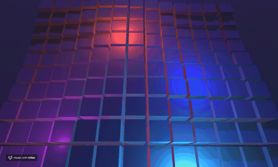

# PerlinNoise_animation

Example Unity 3d project demonstrating how to use PerlinNoise to animate some cubes in a wave-like manner.
See my tutorial on Youtube (in italian) https://www.youtube.com/watch?v=ZCt6P6w68TE

## Preview

